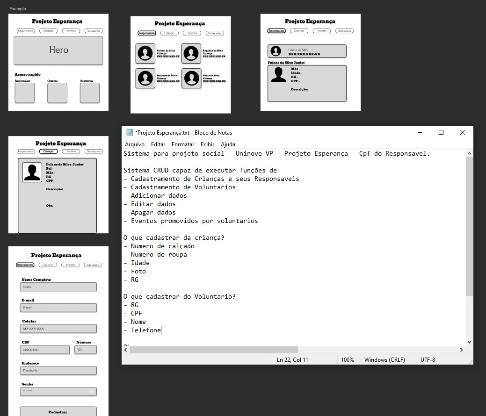

# Projeto Esperança - Uninove VP

## Detalhes

Um Sistema CRUD (Create, Read, Update e Delete) de usuários que permite a criação, leitura, atualização e exclusão de informações de usuários.

Exemplo - Wireframe e Briefing

